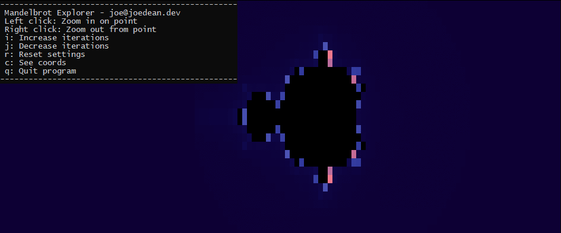

# Mandelbrot's in Heaven

|||
|---|---|
|*Just take a point called C in the complex plane, let Z-naught be zero plus C, and let Z-one be Z-naught plus C, and so on... if the series of Z's will always be close to C and never trend away, that point is in the Mandelbrot Set!*||

***

"Mandelbrot's in Heaven" is a Mandelbrot Set exploration tool for the terminal. It is written in Rust, and uses [crossterm](https://github.com/crossterm-rs/crossterm) for cross-platform terminal interaction. Commands / instructions are displayed upon first running the program.
